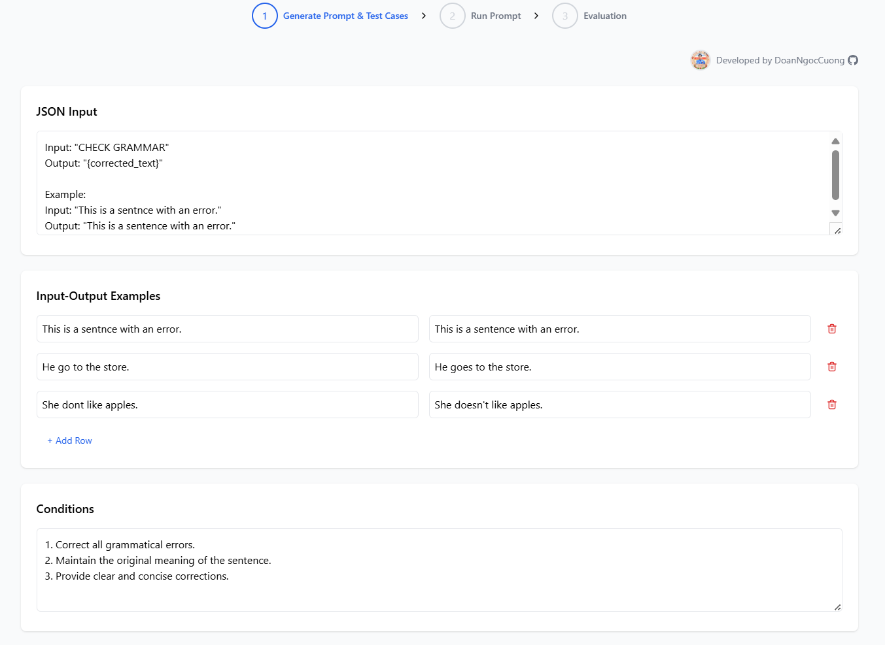
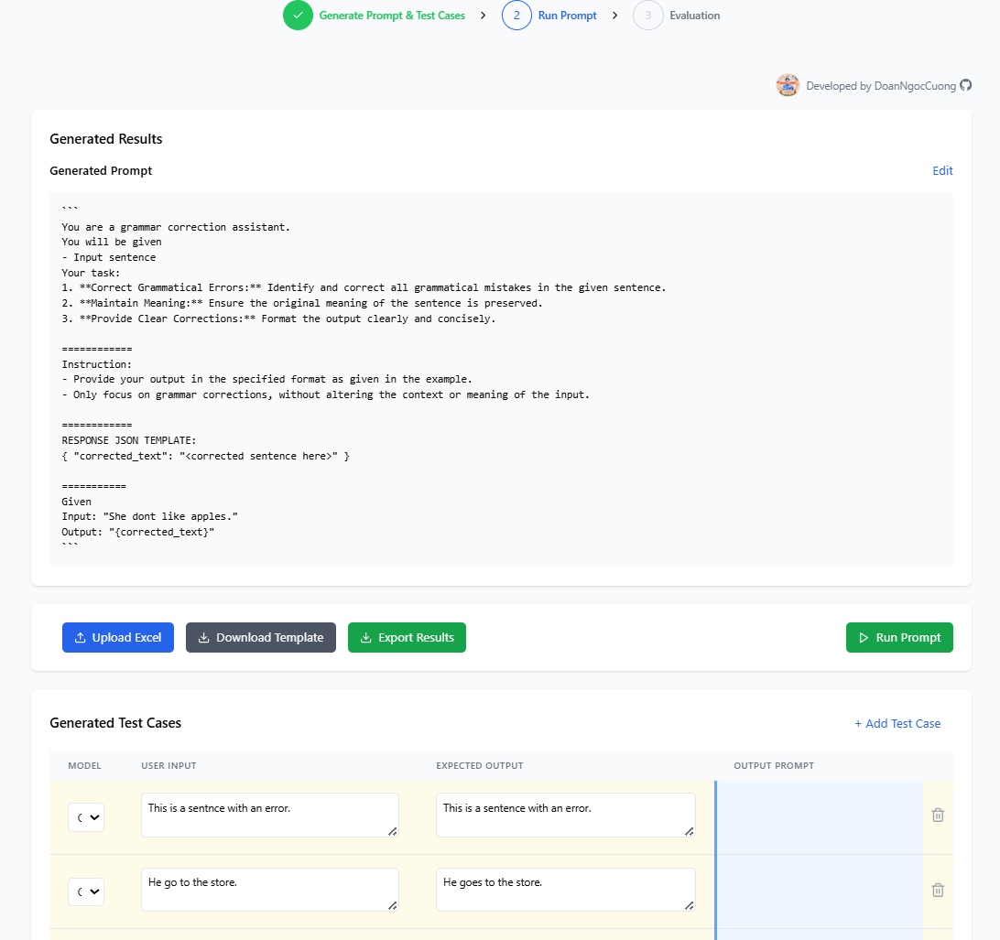

# 1. Mục đích:
- Đóng gói 1 task bị lặp lại đã từ rất lâu (6 tháng mình thực tập).
- Sheet order Prompting được đóng gói trước đó: https://docs.google.com/spreadsheets/d/18eOvC4w3PfDjMg2tX1TqgpvorljPUYgklF49HRpUvVI/edit?gid=472456718#gid=472456718


---
# 2. [] Viết 1 tools Auto Prompting cho IELTS và App The Coach
1. Outcome (Kết quả cuối cùng mong muốn)
✅ Tool Auto Prompting giúp tối ưu hiệu suất tạo prompt cho IELTS và App The Coach, đạt độ chính xác ~90% sau nhiều vòng lặp tự động.
✅ Chuyển giao cho bên IELTS có thể hoàn toàn prompting mà không cần đến Prompting Engineering. 
2. Output (Những gì cần tạo ra để đạt được outcome trên)
- Một tool tự động tạo prompt dựa trên 1-2 samples & điều kiện đầu vào.
- Một bộ test case 20-50 trường hợp, tự động chạy kiểm thử. (gen tự động, người ở giữa được)
- Hệ thống đánh giá dựa trên các tiêu chí:
  - Accuracy (Acc): Độ chính xác của prompt so với mong đợi.
  - Response time: Thời gian phản hồi.
- Cơ chế tối ưu tự động: Tool tự chạy lặp lại nhiều vòng, tinh chỉnh đến khi đạt Acc ~90%.
- Giao diện cho người dùng can thiệp: Nếu cần, người dùng có thể nhập thêm thông tin để tiếp tục tối ưu.
Estimate: 16h - Chiều T4 demo - Chiều T5 đóng
- Tận dụng tài nguyên về APO, APE a Hoàng nghiên cứu trước đó 
- Có thể làm chung với a Hoàng nếu cần


---
# 3. Có 3 khâu:

1. Tự viết Prompt (xài 4o-mini)
2. Tự tạo tests cases (4o-mini)
3. Tự đánh giá Kết quả (xài o1-min/ model LLMs mạnh hơn) và tự lặp lại bước 1, 2 => ra prompt thoả mãn 5 input, output mẫu + trả ra bảng kết quả test Input, Output do AI tự tạo --- trước khi đưa người dùng đánh giá.
4. User đánh giá và feedback lại.
5. Update Prompt.
6. Lặp lại bước 3, 4, 5.


```bash
🔥 Streak 12: 🔥 SHARING WITH YOU A TOOL I BUILT IN 15 HOURS: ⚡️ Prompting Automation Generate, Tuning and Evaluation 🚀
GitHub link in the comments below.

✨ Key functionalities:
1. 🤖 Automatically generates Prompts and Test Cases. 
2. ⚙️ Automates the execution of Prompts with test cases. 
3. 🧪 Automatically evaluates execution results. 

🛠️ Version 1:
✅ The full workflow is functional. However, ⚡ steps 1 and 3 need further prompt tuning. 
🚀 Step 2 is fully operational and can work independently, reducing ⏱️ 80% of the time required for Prompt Engineering. 

#wecommit100x #wecommit100xshare 
#codemely #aiteam #production #aiteam_codemely
#prompting_engineering 
#aicode #react #typescripts #tailwind
```


